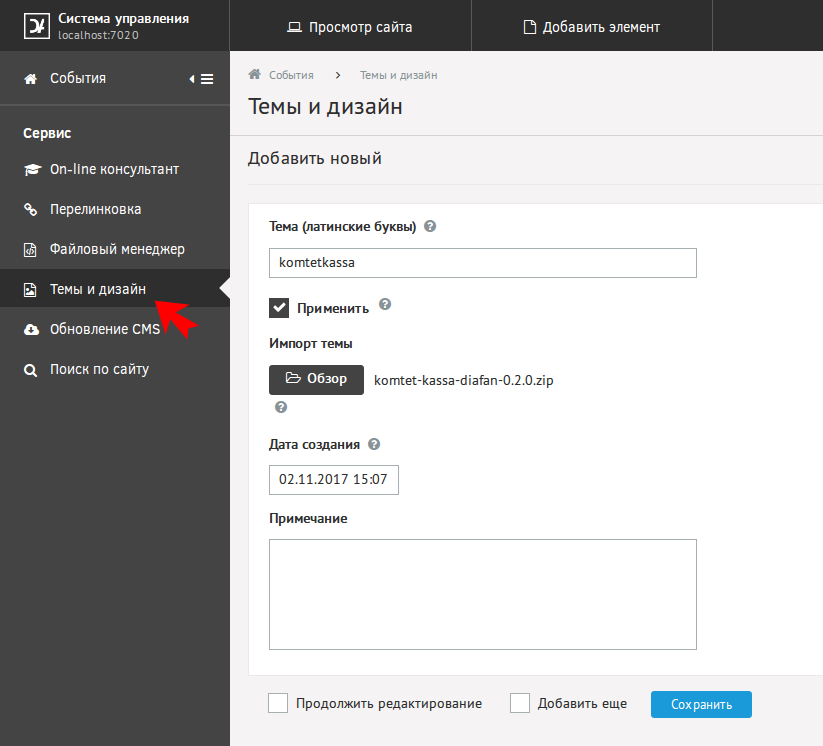
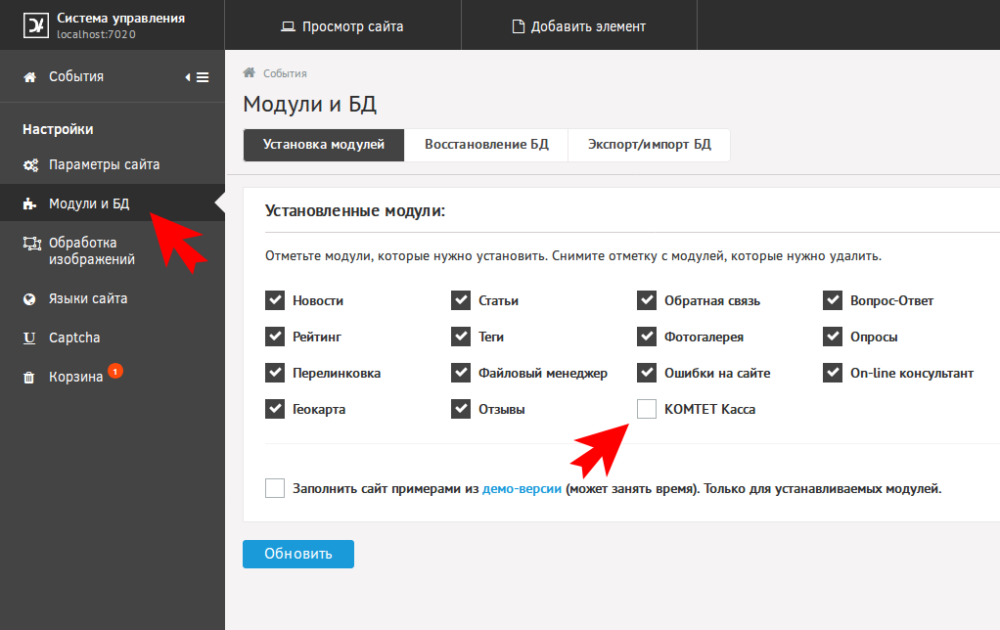
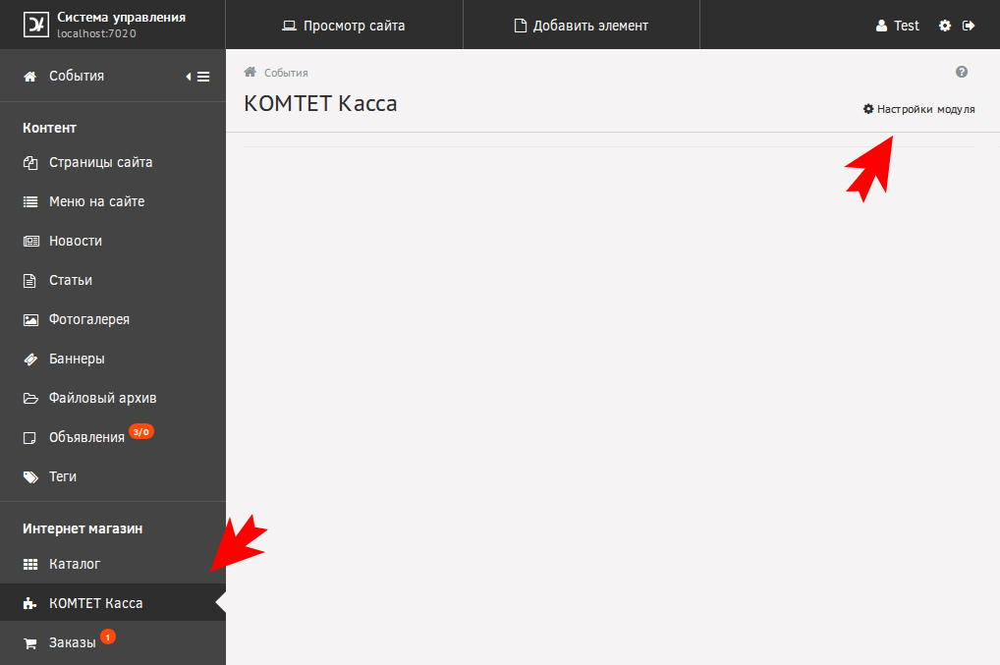
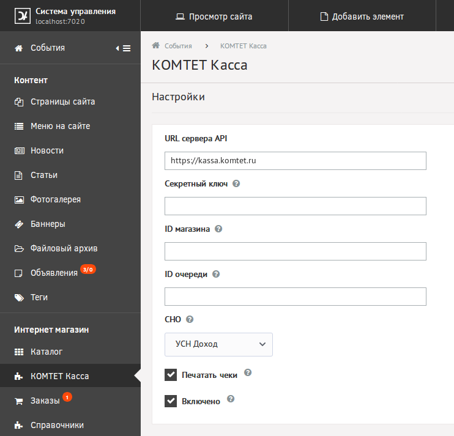

# Установка

Скачать [архив](https://github.com/Komtet/komtet-kassa-diafan/releases).

В разделе "Темы и дизайн" добавить новую тему:

В разделе "Модули и БД" установить модуль:

Перейти к настройкам модуля:

И заполнить необходимые поля:

Success и Fail URL для КОМТЕТ Касса: `адрес-вашего-сайта/komtetkassa/report`
